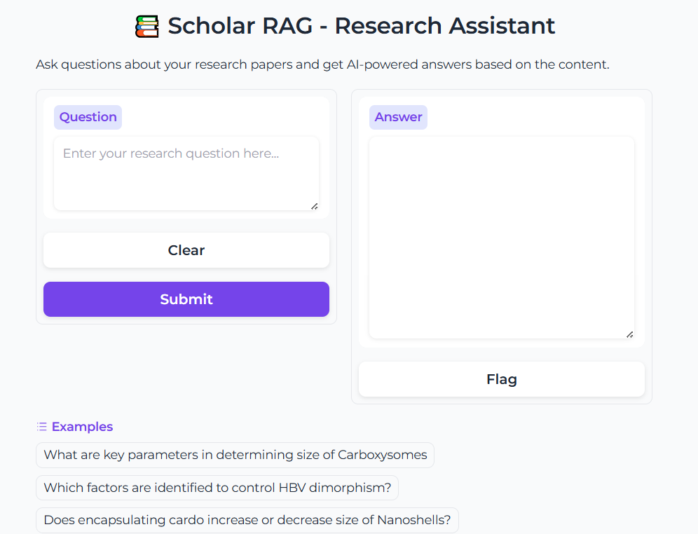

# 📚 Scholar RAG


**Instant Answers from Your Research Library**  
Scholar RAG helps you quickly find answers within your own collection of research articles. Whether you're writing a review paper and need to look up a topic across several papers, or drafting a proposal and want to reference your own work, this tool makes it effortless to search, synthesize, and cite relevant content from your PDFs.

## 📝 How It Works

1. **Just put your research papers (PDFs) in the `data` folder.**
2. **Run the setup script to index your papers.**
3. **Ask questions and get answers grounded in your articles—either via the command line or a web interface.**

No manual tagging, no complex configuration. Scholar RAG automatically extracts metadata and content, making your research library instantly searchable and ready for AI-powered Q&A.

---

## 🚀 Installation

1. **Clone the repository:**
   ```bash
   git clone https://github.com/yourusername/scholar-rag.git
   cd scholar-rag
   ```

2. **Create and activate a virtual environment:**

   For Windows (PowerShell):
   ```powershell
   python -m venv venv
   .\venv\Scripts\activate
   ```

   For Windows (Command Prompt):
   ```cmd
   python -m venv venv
   venv\Scripts\activate.bat
   ```

   For Linux/Mac:
   ```bash
   python -m venv venv
   source venv/bin/activate
   ```

3. **Install dependencies:**
   ```bash
   pip install -r requirements.txt
   ```

4. **Set up your Azure AI resources:**
   - Create an [Azure AI Search](https://portal.azure.com/#create/Microsoft.Search) resource.
   - Create an [Azure OpenAI](https://portal.azure.com/#create/Microsoft.CognitiveServicesOpenAI) resource.
   - Note down the endpoint URLs and API keys for both services.
   > **Need help with Azure setup?**  
   > - [Azure AI Search Documentation](https://learn.microsoft.com/azure/search/)
   > - [Azure OpenAI Service Documentation](https://learn.microsoft.com/azure/ai-services/openai/)
   > - [Quickstart: Create an Azure AI Search service](https://learn.microsoft.com/azure/search/search-create-service-portal)
   > - [Quickstart: Get started with Azure OpenAI](https://learn.microsoft.com/azure/ai-services/openai/quickstart)


5. **Add your Azure credentials to a `.env` file in the project root:**
   ```env
   AZURE_SEARCH_SERVICE_ENDPOINT=your_search_service_name
   AZURE_SEARCH_API_KEY=your_search_api_key
   AZURE_OPENAI_API_KEY=your_openai_api_key
   AZURE_OPENAI_ENDPOINT=your_openai_endpoint
   AZURE_OPENAI_DEPLOYMENT_NAME=your_deployment_name
   ```

---

## 💻 Usage

1. **Place your PDF research papers in the `data` folder.**
> **Note:** If the `data` folder is not available, the app will automatically use the sample PDFs in the `sample_data` folder instead.

2. **Set up your Azure AI Search index and ingest PDFs:**
   ```bash
   python src/scholar_rag_setup.py
   ```

3. **Choose your interface:**

   - **Command-line interface:**
     ```bash
     python src/scholar_rag.py
     ```
     - Test with a sample question
     - Ask your own questions in real time
     - Type 'quit' to exit

   - **Web interface:**
     ```bash
     python src/scholar_rag_gradio.py
     ```

---

## 📁 Project Structure

```
scholar-rag/
├── src/
│   ├── scholar_rag_setup.py       # Sets up index, processes PDFs
│   ├── scholar_rag.py             # Main RAG pipeline logic
│   └── scholar_rag_gradio.py      # Web interface implementation
├── tests/                         # Unit and integration tests
│   ├── test_scholar_rag.py
│   └── test_utils.py
├── sample_data/                   # Example PDFs for testing/demo
├── data/                          # Place your PDF files here
├── .env                           # Azure credentials (excluded from version control)
├── .gitignore                     # Files to ignore in Git
├── README.md                      # Project documentation
└── requirements.txt               # Python dependencies
```


##  Contributing

We welcome contributions!

1.  Fork this repository
2.  Create a new feature branch
3.  Commit your changes
4.  Push the branch
5.  Open a Pull Request


