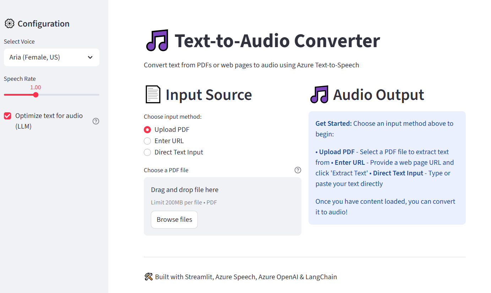

[](https://github.com/farrimoh/text-to-audio/blob/main/LICENSE)



# Listen & Learn! Text-to-Audio Converter 🎧

Easily turn any text, PDF, or web article into high-quality audio files you can listen to while walking, driving, or on the go.

A simple Streamlit app to convert documents and web content into natural-sounding speech using Azure Text-to-Speech.

## Features ✨

- Convert PDFs, web pages, or direct text to audio
- Choose from multiple natural-sounding voices
- Adjust speech rate for comfortable listening
- Download audio files for offline use
- Works great for listening while commuting, exercising, or relaxing

## Architecture 🏗️

- app.py – Streamlit UI & main entry point
- service.py – Core business logic & orchestration layer
- audio_processor.py – Azure TTS integration
- text_processor.py – Text extraction utilities
- llm_client.py – Azure OpenAI integration for text optimization
- audio_output/ – Generated audio files

## Setup ⚙️

1. **Install dependencies:**
   ```bash
   pip install -r requirements.txt
   ```
2. **Configure Azure Speech Service:**
   - Create a Speech Service in Azure Portal
   - Add your credentials to a `.env` file:
     ```env
     AZURE_SPEECH_KEY=your_key
     AZURE_SPEECH_REGION=your_region
     ```
3. **Run the app:**
   ```bash
   streamlit run app.py
   ```

## Usage 🚀

1. **Choose input:** Upload a PDF, enter a URL, or paste text.
2. **Pick a voice & settings:** Select a voice and adjust speed.
3. **Convert & listen:** Click convert, then listen or download your audio from the app.

## Supported File Types & Voices 🎙️

- Input: PDF, web page URL, or plain text
- Voices: Multiple Azure neural voices (male/female, US English)

## License

MIT License

